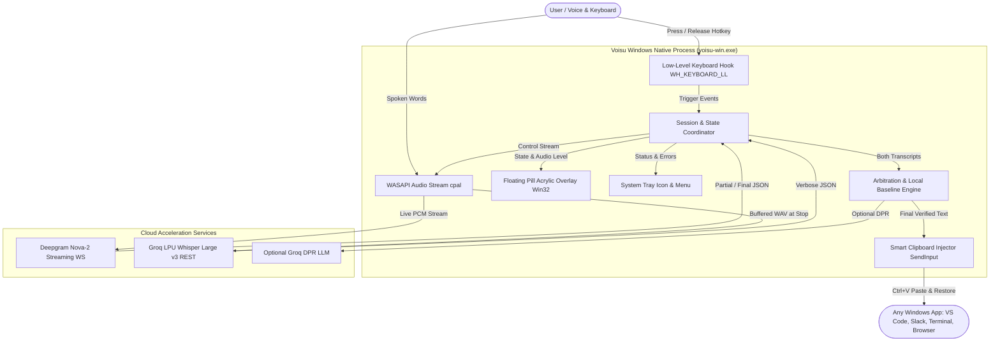

# System Architecture — Voisu for Windows (`voisu-win`)

## 1. System Context Diagram

---

## 2. Component Map

| Component | Responsibility | Tech / Crate |
|---|---|---|
| **`core::hotkey`** | Intercepts keyboard events via `SetWindowsHookEx(WH_KEYBOARD_LL)` on a **dedicated Win32 message-pump thread** (not the Tokio runtime). Implements Hybrid Mode (Hold-to-Talk or Tap-to-Toggle) and suppresses lock-state toggle when using Caps Lock. Includes a liveness watchdog that periodically verifies the hook is still installed. | `windows-sys` / `user32` |
| **`core::audio`** | Captures audio from default Windows input device at **native hardware sample rate** (typically 48kHz) using WASAPI. Performs real-time sinc resampling to 16kHz 16-bit mono via `rubato`. Computes RMS levels for visual feedback and packages memory WAV for batch dispatch. | `cpal`, `rubato`, `hound` |
| **`providers::deepgram`** | Manages asynchronous WebSocket connection (`tokio-tungstenite`). Streams resampled 16kHz audio frames continuously during utterance; parses word timestamps and **per-word confidence scores**. | `tokio-tungstenite`, `serde_json` |
| **`providers::groq`** | Fast multipart HTTPS POST client using `reqwest`. Sends complete memory WAV to Groq LPUs; parses verbose JSON **word timestamps** (no per-word confidence) and **segment-level `avg_logprob`** for confidence proxy. Tracks RPM/RPD rate limit consumption locally. | `reqwest`, `serde_json` |
| **`core::arbitration`** | **Asymmetric** positional Levenshtein alignment between Deepgram and Groq tokens. Executes Slice B4 confidence arbitration using Deepgram per-word confidence + Groq segment-level confidence proxy. Enforces strict fail-closed meaning guards. Reports `ArbitrationMode` (Dual/SingleDeepgram/SingleGroq). | Internal Rust implementation |
| **`core::formatting`** | Deterministic local baseline formatting: spoken punctuation replacement (`"comma"` $\rightarrow$ `","`), number parsing, quote pairs, and contraction normalization. | `regex` |
| **`delivery::clipboard`** | Backs up existing clipboard data (`CF_UNICODETEXT`), sets new transcript, synthesizes `Ctrl+V` keypresses via `SendInput`, monitors clipboard consumption via `AddClipboardFormatListener`, and restores original clipboard within configurable timeout (default 200ms). Falls back to direct `SendInput` Unicode if clipboard is locked. | `windows-sys` |
| **`ui::overlay`** | High-performance, click-through, transparent Win32 layered window with DWM Acrylic blur via `DwmSetWindowAttribute(DWMWA_SYSTEMBACKDROP_TYPE, DWMSBT_TRANSIENTWINDOW)`. Renders live audio level meter and state transitions with fluid animations. Falls back to simple semi-transparent window on Windows 10. | `windows-sys` |
| **`ui::tray`** | System tray notification icon with context menu for status, settings wizard, and graceful exit. | `tray-icon` / Win32 Shell_NotifyIcon |

---

## 3. Integration Points & Failure Behavior

### 3.1 Deepgram WebSocket (`wss://api.deepgram.com`)
- **Protocol**: Secure WebSocket (`wss`), TLS 1.3.
- **Normal Flow**: Opened on key press; audio pushed every 20ms; closed on key release.
- **Failure / Timeout**: If connection drops, handshake stalls, or rate limits occur: Deepgram mark is flagged `Unavailable`. Pipeline continues with Groq transcript exclusively. Zero user interruption.

### 3.2 Groq Whisper API (`https://api.groq.com/openai/v1/audio/transcriptions`)
- **Protocol**: HTTPS POST Multipart Form.
- **Normal Flow**: Complete WAV buffer posted at key release; responds in ~150–250ms via Groq LPUs.
- **Failure / Timeout**: Hard 800ms timeout on Groq response. If timeout expires or HTTP 429/5xx returned: Groq mark flagged `Unavailable`. Pipeline delivers Deepgram's streaming transcript.

### 3.3 Target Windows Application
- **Protocol**: Win32 Input Queue & Clipboard API.
- **Normal Flow**: Focus window identified via `GetForegroundWindow()`; clipboard updated; synthetic `Ctrl+V` injected; clipboard restore triggered by `AddClipboardFormatListener` detecting target app consumption, or after configurable timeout (default 200ms).
- **Failure / Fallback**: If target window is elevated or clipboard is temporarily locked by another process (e.g. clipboard manager): retries clipboard open with exponential backoff (up to 5 retries over 100ms); if still locked, falls back to direct `SendInput` Unicode character typing.
- **Windows 11 Clipboard History**: Consider using `ExcludeClipboardContentFromMonitorProcessing` to prevent Voisu's transient clipboard writes from appearing in `Win+V` history.

---

## 4. Deployment Topology & Packaging
- **Host Platform**: Windows 10 / Windows 11 (x86_64, amd64).
- **Execution Model**: Single standalone native executable (`voisu-win.exe`) running in user session (no background daemon or admin service required).
- **Installation**:
  - Portable single `.exe` binary.
  - Optional Windows Installer (`.msi` via WiX or InnoSetup).
- **Config Storage**: Stored in `%APPDATA%\voisu\config.json`.
- **Credential Storage**: Windows Credential Manager (`wincred`) or local encrypted file fallback.

---

## 5. Scalability & Reliability Notes

- **Concurrency Model**: Async runtime powered by `tokio` (multi-threaded). Audio capture runs on a dedicated high-priority OS thread to prevent audio buffer underruns. Keyboard hook runs on a **separate dedicated Win32 message-pump thread** (must call `GetMessage`/`DispatchMessage`; never runs on the Tokio runtime).
- **Hook Liveness**: A watchdog periodically injects a synthetic `VK_F24` keypress and verifies the hook callback receives it, to detect Windows' silent hook removal (triggered when callbacks exceed the `LowLevelHooksTimeout` ~1000ms threshold).
- **Latency SLO**:
  - Audio Resampling (48kHz→16kHz): $< 2\text{ ms}$ per chunk.
  - Deepgram Streaming Latency: $50\text{ ms}$ after stop.
  - Groq LPU Inference Latency: $180\text{ ms}$ after stop.
  - Arbitration & Local Formatting: $< 2\text{ ms}$.
  - Windows Injection: $< 15\text{ ms}$.
  - Clipboard Restore: $\le 200\text{ ms}$ (listener-based or timeout).
  - Total end-to-end release-to-text latency: $\approx 220\text{–}300\text{ ms}$ (well under the $350\text{ ms}$ threshold).
- **Memory Footprint**:
  - Base idle: $< 20\text{ MB}$ RSS.
  - Active audio buffer: Bounded circular buffer (max 60 seconds of 16kHz 16-bit PCM = $1.92\text{ MB}$ RAM).
- **Graceful Shutdown**: `SetConsoleCtrlHandler` intercepts `Ctrl+C` and system shutdown signals. Tray "Exit" triggers orderly teardown: uninstall keyboard hook → close WASAPI stream → close Deepgram WebSocket → restore Caps Lock state to original → flush config → process exit.
