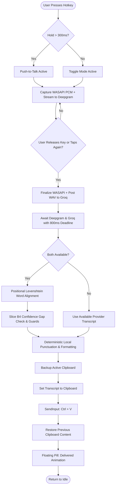

# Application Flow & Interaction Specification — Voisu for Windows (`voisu-win`)

## 1. Happy Path Flows

### Flow 1.1: Push-to-Talk Dictation (Hold Key)
1. **User Action**: User places cursor in target editor (e.g. VS Code, Slack, or Chrome) and presses and holds the Trigger Key (`Caps Lock` or `Right Alt`).
2. **System Response**:
   - Keyboard hook intercepts KeyDown event and suppresses system Caps Lock toggle.
   - Session coordinator transitions from `IDLE` to `RECORDING`.
   - Native audio engine opens WASAPI 16kHz capture stream.
   - Deepgram WebSocket connection opens and begins streaming 20ms audio chunks.
   - Floating pill appears near cursor / screen bottom in `Listening` state with animated live RMS waveform.
3. **User Action**: User speaks naturally (e.g. *"Create a new function calculate total with parameters price and tax rate comma then return price plus tax period"*).
4. **User Action**: User releases the Trigger Key (hold duration was $> 300\text{ ms}$).
5. **System Response**:
   - Keyboard hook catches KeyUp event.
   - Audio capture halts; in-memory WAV header attached to buffered PCM.
   - Complete WAV posted asynchronously to Groq Whisper LPU.
   - Deepgram WebSocket sends close/finalize frame.
   - Floating pill transitions to `Arbitrating` state (amber pulse).
   - Within ~200ms, both provider responses arrive.
   - Asymmetric Levenshtein alignment runs; confidence arbitration applies Deepgram word-level + Groq segment-level proxy filtering; deterministic local formatter converts *"comma"* $\rightarrow$ `","` and *"period"* $\rightarrow$ `"."`.
   - Windows injector captures previous clipboard contents, sets formatted transcript, fires synthetic `Ctrl+V`, monitors consumption via `AddClipboardFormatListener`, and restores prior clipboard within configurable timeout (default 200ms).
   - Floating pill flashes green `Delivered` icon for 600ms, then fades to hidden.
   - State returns to `IDLE`.

---

### Flow 1.2: Tap-to-Toggle Dictation (Hands-Free Speech)
1. **User Action**: User taps the Trigger Key once (press and release $< 300\text{ ms}$).
2. **System Response**:
   - Keyboard hook recognizes tap gesture; starts recording and locks in `RECORDING` state.
   - Floating pill appears with a glowing red indicator and live sound meter.
3. **User Action**: User speaks a long paragraph or instructions hands-free.
4. **User Action**: User taps the Trigger Key a second time.
5. **System Response**:
   - Recording stops immediately; pipeline proceeds to `PROCESSING` $\rightarrow$ `DELIVERY` identically to Flow 1.1.

---

### Flow 1.3: Setup & Credential Configuration
1. **User Action**: User runs `voisu-win setup` from PowerShell or selects "Settings" from the system tray menu.
2. **System Response**: Interactive console or GUI prompt displays:
   - Deepgram API Key (validated via test connection).
   - Groq API Key (validated via test model query).
   - Hotkey selector (`Caps Lock`, `Right Alt`, `F8`).
   - Interaction mode (`Hybrid`, `PushToTalk`, `Toggle`).
3. **System Response**: Saves validated configuration to `%APPDATA%\voisu\config.json` and writes secrets securely to Windows Credential Manager.

---

## 2. Error & Edge Case Paths

| Step | Failure Condition | System Recovery Action |
|---|---|---|
| Audio Capture | Default microphone disconnected or muted | Floating pill turns red with exclamation icon; emits soft alert sound; cancels session without crashing. |
| Deepgram WS | Connection timeout, invalid token, or network drop | Mark Deepgram `Unavailable`; rely exclusively on Groq Whisper response; delivers transcript safely without lag. |
| Groq REST | API rate limit (HTTP 429) or 800ms timeout | Mark Groq `Unavailable`; rely exclusively on Deepgram streaming transcript; delivers immediately. |
| Both Providers | Total network failure (offline) | Floating pill displays "Offline — Check Connection"; aborts delivery; preserves speech buffer in memory. |
| Text Injection | Target app running as elevated Administrator (UIPI block) | Tray notification advises: *"Target app requires Administrator privileges. Run Voisu as Admin or switch to SendInput mode."* |
| Clipboard Lock | Another tool (e.g. clipboard manager) locks clipboard | Retry loop (5 attempts with 20ms backoff); if still locked, fallback automatically to character-by-character `SendInput` Unicode typing. |
| Clipboard History Leak | Windows 11 `Win+V` clipboard history captures transient Voisu text | Use `ExcludeClipboardContentFromMonitorProcessing` flag when setting clipboard data to suppress history recording. |
| Groq Rate Limit | User exceeds 20 RPM or 2,000 RPD on Groq free tier | Track RPM/RPD locally; when approaching limits, gracefully degrade to Deepgram-only mode with tray notification: *"Groq quota reached — using Deepgram only."* |
| Hotkey Stuck | User holds hotkey past 60 seconds | Auto-stop watchdog triggers to prevent memory exhaustion and runaway API costs. |
| Hook Silent Death | Windows silently removes `WH_KEYBOARD_LL` hook due to slow callback | Liveness watchdog injects synthetic `VK_F24` and verifies receipt; if hook is dead, re-installs it and shows tray warning. |

---

## 3. Flow Diagram: Detailed Dictation State Flow

---

## 4. Graceful Shutdown Flow

1. **Trigger**: User selects "Exit Voisu" from tray menu, presses `Ctrl+C` in console, or the system sends a shutdown signal.
2. **System Response**:
   - `SetConsoleCtrlHandler` callback fires, setting the shutdown flag.
   - If in `RECORDING` state: immediately stop audio capture, close Deepgram WebSocket, discard buffered audio.
   - Uninstall `WH_KEYBOARD_LL` hook via `UnhookWindowsHookEx`.
   - Restore Caps Lock LED/state to the original value captured at startup (prevents leaving Caps Lock in a toggled state).
   - Close WASAPI audio device handle.
   - Flush any pending config changes to `%APPDATA%\voisu\config.json`.
   - Destroy overlay window and remove tray icon.
   - Exit process with code 0.
