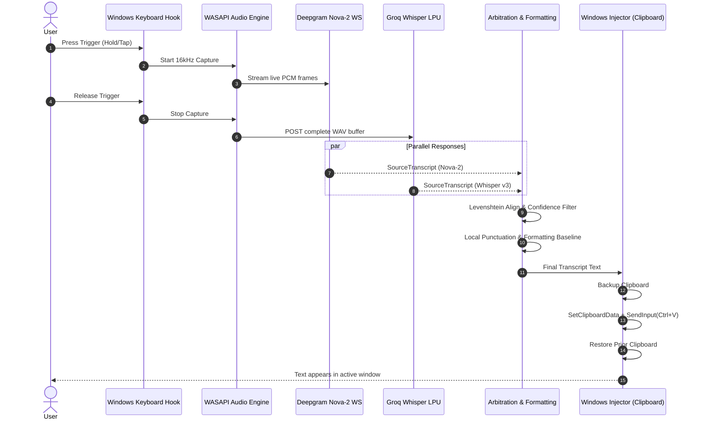

# Schema & Contract Specification — Voisu for Windows (`voisu-win`)

## 1. Entity Definitions

### 1.1 `AudioFrame`
Resampled PCM audio slice produced by the audio capture pipeline (WASAPI native capture → `rubato` sinc resampling → 16kHz output).
- `samples`: `Vec<i16>` — 16-bit signed PCM samples at 16,000 Hz, mono. **Note**: Most Windows hardware captures at 48kHz; the audio engine resamples to 16kHz in real-time using the `rubato` crate before emitting `AudioFrame` values.
- `timestamp_ms`: `u64` — Monotonic millisecond timestamp from recording start.
- `rms_level`: `f32` — Root-mean-square amplitude normalized between `0.0` and `1.0`.

### 1.2 `WordToken`
Individual transcribed token with timing and confidence metadata.
- `word`: `String` — Normalized or verbatim token string.
- `start_ms`: `u32` — Start time offset in milliseconds relative to utterance start.
- `end_ms`: `u32` — End time offset in milliseconds.
- `confidence`: `f64` — Normalized confidence score between `0.0` and `1.0`.
- `punctuated`: `Option<String>` — Verbatim word including trailing punctuation if provided.

### 1.3 `SourceTranscript`
Complete transcription payload emitted by an individual STT provider.
- `provider`: `ProviderId` — `Deepgram` | `Groq`
- `raw_text`: `String` — Full concatenated string.
- `words`: `Vec<WordToken>` — Positional sequence of recognized words with confidence.
- `duration_ms`: `u32` — Total audio duration processed.
- `latency_ms`: `u32` — Total elapsed time from recording stop until transcript availability.

### 1.4 `ArbitrationMode`
Indicates which provider combination was used during arbitration.
- `DualProvider` — Both Deepgram and Groq transcripts were available; full Slice B4 arbitration was performed.
- `SingleDeepgram` — Only Deepgram transcript was available (Groq timed out, rate-limited, or unconfigured).
- `SingleGroq` — Only Groq transcript was available (Deepgram failed or unconfigured).

### 1.5 `ArbitratedTranscript`
Result of divergence alignment and confidence arbitration.
- `selected_text`: `String` — Final assembled transcript text.
- `primary_source`: `ProviderId` — The incumbent backbone provider.
- `arbitration_mode`: `ArbitrationMode` — Which provider combination was used (see §1.4).
- `flipped_regions`: `Vec<FlippedRegion>` — Detailed log of word substitutions made.
- `is_source_derived`: `bool` — Invariant check confirming all tokens originated from source transcripts.

### 1.6 `AppConfig`
Persisted user preferences and provider credentials.
- `deepgram_api_key`: `Option<String>` — Deepgram API secret token.
- `groq_api_key`: `Option<String>` — Groq API secret token.
- `trigger_key`: `TriggerKey` — `CapsLock` (default) | `RightAlt` | `F8` | `Custom(u32)`
- `interaction_mode`: `InteractionMode` — `Hybrid` (default) | `PushToTalk` | `Toggle`
- `delivery_mode`: `DeliveryMode` — `SmartClipboard` (default) | `SendInputUnicode`
- `audio_device_id`: `Option<String>` — Default Windows audio input device name.
- `native_sample_rate`: `Option<u32>` — Override native capture sample rate (`null` = auto-detect from hardware; most Windows devices default to 48,000 Hz).
- `clipboard_restore_timeout_ms`: `u32` — Maximum time to wait for target app to consume clipboard data before restoring (default: `200`, range: `50`–`1000`).
- `dpr_policy`: `DprPolicy` — `Adaptive` (default) | `Natural` | `Structured`

---

## 2. Configuration Schema (`config.json`)

```json
{
  "$schema": "http://json-schema.org/draft-07/schema#",
  "title": "VoisuWinConfig",
  "type": "object",
  "properties": {
    "deepgram_api_key": { "type": ["string", "null"] },
    "groq_api_key": { "type": ["string", "null"] },
    "trigger_key": {
      "type": "string",
      "enum": ["CapsLock", "RightAlt", "F8", "Custom"],
      "default": "CapsLock"
    },
    "interaction_mode": {
      "type": "string",
      "enum": ["Hybrid", "PushToTalk", "Toggle"],
      "default": "Hybrid"
    },
    "delivery_mode": {
      "type": "string",
      "enum": ["SmartClipboard", "SendInputUnicode"],
      "default": "SmartClipboard"
    },
    "dpr_policy": {
      "type": "string",
      "enum": ["Adaptive", "Natural", "Structured"],
      "default": "Adaptive"
    },
    "native_sample_rate": {
      "type": ["integer", "null"],
      "default": null,
      "description": "Override native capture sample rate in Hz. null = auto-detect from hardware."
    },
    "clipboard_restore_timeout_ms": {
      "type": "integer",
      "default": 200,
      "minimum": 50,
      "maximum": 1000,
      "description": "Max ms to wait for target app to consume clipboard before restoring prior content."
    },
    "custom_dictionary": {
      "type": "array",
      "items": { "type": "string" },
      "default": []
    }
  },
  "additionalProperties": false
}
```

---

## 3. External API Contracts

### 3.1 Deepgram Live Streaming WebSocket
- **Protocol**: `wss`
- **URL**: `wss://api.deepgram.com/v1/listen?model=nova-2&smart_format=true&encoding=linear16&sample_rate=16000&channels=1`
- **Auth Header**: `Authorization: Token {deepgram_api_key}`
- **Payload In**: Binary raw PCM frames (16kHz 16-bit mono, 20ms chunks / 640 bytes).
- **Payload Out (JSON)**:
```json
{
  "type": "Results",
  "channel_index": [0, 1],
  "duration": 2.45,
  "start": 0.0,
  "is_final": true,
  "speech_final": true,
  "channel": {
    "alternatives": [
      {
        "transcript": "Hello world.",
        "confidence": 0.982,
        "words": [
          { "word": "hello", "start": 0.12, "end": 0.45, "confidence": 0.985, "punctuated_word": "Hello" },
          { "word": "world", "start": 0.48, "end": 0.82, "confidence": 0.978, "punctuated_word": "world." }
        ]
      }
    ]
  }
}
```

### 3.2 Groq Whisper Cloud API
- **Protocol**: `HTTPS POST` (Multipart Form)
- **URL**: `https://api.groq.com/openai/v1/audio/transcriptions`
- **Auth Header**: `Authorization: Bearer {groq_api_key}`
- **Request Form Parts**:
  - `file`: WAV audio buffer (RIFF header, 16kHz mono).
  - `model`: `"whisper-large-v3-turbo"`
  - `response_format`: `"verbose_json"`
  - `timestamp_granularities[]`: `"word"` (enables word-level timestamps)
  - `temperature`: `0.0`
- **Response Shape (JSON)**:
> ⚠️ **CRITICAL NOTE**: Groq's OpenAI-compatible Whisper API does **not** return per-word `confidence` scores. Only **segment-level** confidence is provided. Word entries contain timestamps only. The arbitration engine uses the segment-level confidence as a proxy for all words within that segment (see Asymmetric Arbitration in `architecture-essentials.md` ADR-004).
```json
{
  "task": "transcribe",
  "language": "english",
  "duration": 2.45,
  "text": "Hello world.",
  "segments": [
    {
      "id": 0,
      "text": "Hello world.",
      "start": 0.0,
      "end": 2.45,
      "avg_logprob": -0.15,
      "no_speech_prob": 0.01
    }
  ],
  "words": [
    { "word": "Hello", "start": 0.12, "end": 0.46 },
    { "word": "world.", "start": 0.48, "end": 0.84 }
  ]
}
```

---

## 4. State Machines

### 4.1 Dictation Lifecycle State Machine

```
              ┌──────────────────────────────────────────────────┐
              │                                                  │
              ▼                                                  │ Cancel / Timeout
         ┌───────────┐         Key Press                         │
         │   IDLE    │────────────────────────────┐              │
         └───────────┘                            ▼              │
               ▲                            ┌───────────┐        │
               │                            │ RECORDING │        │
               │                            └───────────┘        │
               │                                  │              │
               │ Key Release / Toggle Stop        ▼              │
               │                            ┌───────────┐        │
               │                            │ PROCESSING│────────┘
               │                            └───────────┘
               │                                  │
               │ Delivery Completed               ▼
               │                            ┌───────────┐
               └────────────────────────────│ DELIVERED │
                                            └───────────┘
```

| Current State | Event | Next State | Actions Executed |
|---|---|---|---|
| `IDLE` | `TriggerPressed` (Hold or Tap) | `RECORDING` | Open WASAPI stream at native rate; start `rubato` resampler; init Deepgram WebSocket; display Floating Pill (red/listening). |
| `RECORDING` | `AudioFrame` arrived | `RECORDING` | Update RMS meter; push resampled 16kHz PCM to Deepgram WS; buffer PCM to RAM for Groq. |
| `RECORDING` | `TriggerReleased` (Hold) or `TriggerPressed` (Toggle) | `PROCESSING` | Close WASAPI; finalize Deepgram; POST WAV buffer to Groq LPU; Pill enters `Arbitrating`. |
| `RECORDING` | `CancelRequested` (Escape or Hotkey Timeout >60s) | `IDLE` | Drop buffers; close streams; hide Pill. |
| `PROCESSING` | `TranscriptsReady` or `ProviderDeadlineReached` | `DELIVERED` | Run asymmetric Levenshtein alignment; evaluate confidence gaps (Deepgram word + Groq segment proxy); run local formatting; inject text; Pill enters `Delivered`. |
| `DELIVERED` | Clipboard consumed or restore timeout elapsed | `IDLE` | Restore clipboard (via `AddClipboardFormatListener` or timeout); hide Pill; reset accumulators. |
| Any | `ShutdownRequested` (Tray Exit / `Ctrl+C` / `SetConsoleCtrlHandler`) | `SHUTDOWN` | Uninstall keyboard hook; close WASAPI stream; close Deepgram WebSocket; restore Caps Lock state; save config; process exit. |

---

## 5. Data Flow Diagram


